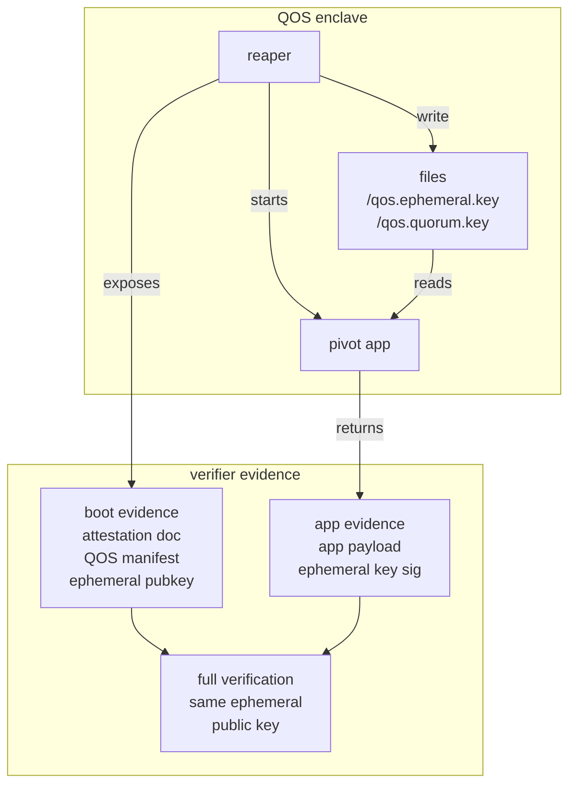

# Enclave Keys

This document is for QOS app authors who need to decide which enclave key to
use from a pivot app. It explains how the reaper, pivot app, manifest, quorum
key, and ephemeral key fit together.

For Boot Proof and App Proof concepts and verification details, see Turnkey's
[Proofs and Verification](https://docs.turnkey.com/features/verifiable-cloud/proofs-and-verification)
documentation. For the control-task and app-start mechanics, see
[QOS Networking](networking.md).

## Runtime Shape

A QOS enclave contains the reaper and the pivot app. The reaper owns the QOS
control path, writes the boot state files through QOS handles, and starts the
pivot app only after the manifest, pivot binary, and quorum key are present.

The control task (collapsed into the reaper in the above diagram) accepts boot, provisioning, key-forwarding, health, status, and
attestation requests. The pivot app is the application that runs after QOS has
finished provisioning key material.

## Files Available To The App

| File | Contents | App-author use |
| --- | --- | --- |
| `/qos.manifest` | The approved QOS manifest envelope. | Inspect the namespace, nonce, pivot configuration, quorum public key, quorum sets, and enclave PCR configuration. |
| `/qos.ephemeral.key` | The current enclave Ephemeral Key. | Sign enclave results, create App Proofs, and decrypt data encrypted to this specific enclave. |
| `/qos.quorum.key` | The namespace Quorum Key. | Encrypt long-lived state and, when exact enclave attribution is not required, sign long-lived data. |

During standard boot and key forwarding, QOS first creates an Ephemeral Key that
is used as the encryption target for provisioning. After the Quorum Key is
reconstructed or injected, QOS rotates `/qos.ephemeral.key` before starting the
pivot app. That lets application-level uses of the Ephemeral Key stay separate
from boot-time key transport.

## Quorum Key

The Quorum Key is the long-lived key for a namespace. Multiple enclaves in the
same namespace can receive the same Quorum Key after they satisfy the QOS
provisioning or key-forwarding protocol.

Use the Quorum Key when the data or identity should survive across enclave
instances, restarts, horizontal scaling, and application upgrades. Common uses:

- encrypting application state that should exist across application versions and enclave instances;
- signing data when the verifier only needs to know that a valid namespace enclave produced the signature.

## Ephemeral Key

The Ephemeral Key is specific to an enclave instance. Its public key can be
bound into an attestation document together with the QOS manifest hash and Nitro
PCR measurements.

Use the Ephemeral Key when the output needs to be tied to a specific attested
enclave and the code/configuration identified by its manifest. Common uses:

- proving a response came from a particular enclave instance (App Proof);
- decrypting messages or secrets encrypted to this enclave's ephemeral public key.

For App Proof payload design and verifier behavior, see Turnkey's
[Proofs and Verification](https://docs.turnkey.com/features/verifiable-cloud/proofs-and-verification)
documentation.

## Related Docs

- [Proofs and Verification](https://docs.turnkey.com/features/verifiable-cloud/proofs-and-verification)
  explains Boot Proofs, App Proofs, and public verification tooling.
- [QOS Networking](networking.md) explains how the reaper starts the control
  task, bridge tasks, and pivot app.
- [Boot Standard](boot_standard.md) explains provisioning a fresh enclave from
  quorum key shares.
- [Key Forward](key_forward.md) explains provisioning a new enclave from an
  already provisioned enclave in the same namespace.
- [QOS Key Set Specification](../src/qos_p256/SPEC.md) describes the key
  schemes used by QOS keys.
