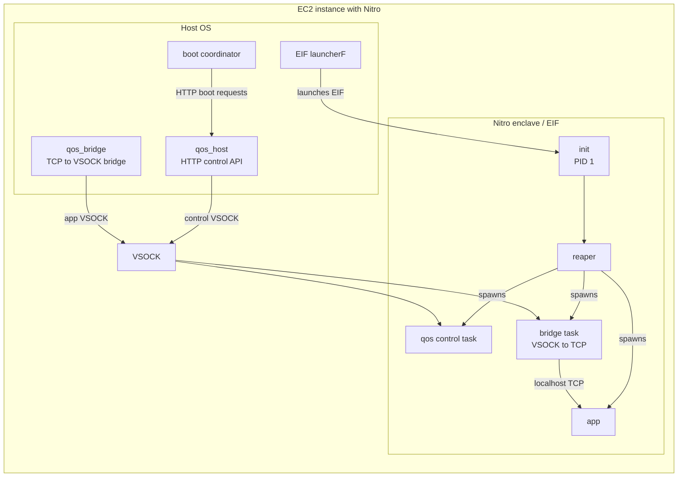
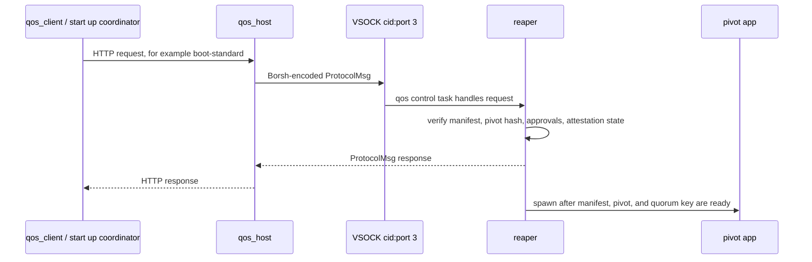
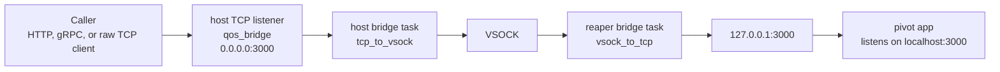
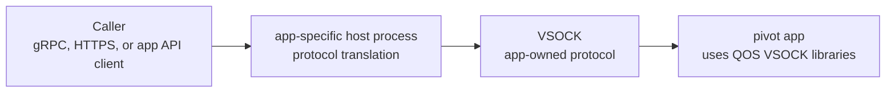
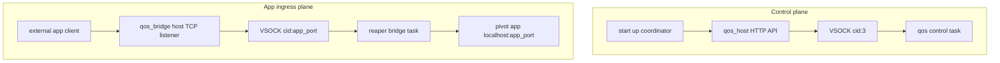

# QOS Networking

This document describes the current QOS networking model: which components run,
where VSOCK sits, how traffic reaches the pivot app, and how the bridge is
configured. It uses generic component names for deployment-specific pieces and
focuses on the current bridge-based design.

## Runtime Topology

QOS runs on an AWS Nitro-enabled EC2 instance. The host side has normal network
access and runs the processes that launch and operate the enclave. The enclave
side has no direct host networking; its external communication path is VSOCK.



In production there may be multiple enclave instances on the same EC2 node. Each
enclave has its own VSOCK context identifier, or CID.

## Control Plane

The control plane is used to bring the enclave through standard boot or
key forwarding. It also supports health checks, and status queries. The control plane
does not carry normal pivot app traffic in the bridge-based model.



The enclave init process creates the control socket at VSOCK port `3`:

```rust
// src/init/init.rs
const START_PORT: u32 = 3;
SocketAddress::new_vsock(cid, START_PORT, VMADDR_NO_FLAGS);
```

`qos_host` exposes an HTTP API on the host for managing the control plane.

```bash
qos_host \
  --host-ip 0.0.0.0 \
  --host-port 3001 \
  --cid 16 \
  --port 3
```

For local development, the same control-plane code can use a Unix socket instead
of VSOCK. This lets developers run the QOS core locally without booting a Nitro
enclave.

## Pivot App Ingress

Current app ingress is bridge-based. The app listens on localhost inside the
enclave using an ordinary TCP protocol such as HTTP or gRPC. The host-side
`qos_bridge` listens on a host TCP port and pipes each accepted connection over
VSOCK to a bridge task running inside the reaper. The in-enclave bridge
task then connects to the app on `127.0.0.1:<port>`.



The bridge is deliberately protocol-agnostic. Once both sides have connected,
QOS uses `tokio::io::copy_bidirectional` to pipe bytes in both directions. The
bridge does not inspect, wrap, unwrap, or multiplex application messages. The
kernel creates a separate stream for each accepted connection, so one VSOCK port
can support multiple simultaneous connection streams.

This is the main difference from the older internal-app model, where an app host
translated an external protocol into QOS-specific messages and the app had to
participate in QOS-specific socket handling. With the bridge, app authors can
write a normal TCP server and bind it to localhost inside the enclave.

## Direct VSOCK App Mode

Apps can also bypass `qos_bridge` and communicate over VSOCK directly. In this
mode, the app does not expose a localhost TCP server for QOS to bridge. Instead,
the app uses the QOS socket libraries, such as `SocketAddress`, `Stream`, and
`StreamPool`, to listen on or connect to a VSOCK port itself.



This path gives the app more control over what crosses the VSOCK boundary. The
host-side process can terminate or parse a public protocol such as gRPC or
HTTPS, translate it into an app-specific VSOCK protocol, and send only the
minimal data the enclave app needs. That can reduce the amount of generic TCP
networking inside the enclave and avoid exposing the app as a normal TCP server.

The tradeoff is that the app becomes QOS-aware. It must link against the QOS
libraries and use the QOS VSOCK abstractions directly. It also needs an
app-specific host-side process that knows how to translate external requests
into the app's VSOCK protocol and translate responses back to the caller.
Without that host-side process, callers will not have a normal HTTP, HTTPS, or
gRPC endpoint to talk to.

## Bridge Configuration

Bridge configuration lives in the manifest under `pivot.bridge_config`. The
currently implemented variant is `server`, which means "accept connections on
the host and forward them into the enclave app."

```json
[
  {
    "type": "server",
    "port": 3000,
    "host": "0.0.0.0"
  }
]
```

The `port` is used on both sides by default:

- Host side: `qos_bridge` binds `host:port`, for example `0.0.0.0:3000`.
- App side: the reaper bridge connects to `127.0.0.1:3000`.

The `host` field is only the host-side bind address. Inside the enclave, the
reaper currently connects to `127.0.0.1:<port>`.

`qos_bridge` learns this configuration from `qos_host`. It polls the
`/qos/enclave-info` endpoint until the enclave has a manifest, reads the
manifest envelope, and starts the configured host-side bridges.

```bash
qos_bridge \
  --control-url http://127.0.0.1:3001/qos \
  --cid 16
```

For local development, use `--usock` instead of `--cid`.

```bash
qos_bridge \
  --control-url http://127.0.0.1:3001/qos \
  --usock /tmp/enclave-example/example.sock
```

Multiple bridged ports are supported by adding multiple `server` entries with
distinct ports.

## Enclave Network Setup

The enclave starts from a minimal Linux environment. There is no normal host
network interface available to the app. During init, QOS performs the minimal
network setup required for bridge-based app ingress:

- mounts the basic filesystems required by the init and pivot process;
- initializes the AWS Nitro platform support used for NSM and attestation;
- brings up the loopback interface;
- assigns `127.0.0.1` to `lo`;
- starts the reaper with the enclave CID and control VSOCK port.

The loopback setup matters because bridged apps are ordinary TCP servers inside
the enclave. They should bind to localhost, for example `127.0.0.1:3000`, and
let QOS handle the VSOCK boundary.

## Data Flow Summary



The control plane and app ingress plane use separate VSOCK ports and separate
responsibilities:

- `qos_host` is for QOS lifecycle and administrative protocol traffic.
- `qos_bridge` is for application traffic.
- The reaper owns both the QOS control task and the in-enclave
  side of app bridging.
- The pivot app owns its own application protocol and concurrency behavior.

## Concurrency And Limits

The bridge itself does not enforce one-request-at-a-time semantics. For each
accepted host TCP connection, it creates a corresponding VSOCK connection and
then pipes bytes between the streams. If an app needs to restrict concurrency,
for example to ensure only one customer secret is processed at a time, that
should be enforced in the app, not assumed from the bridge.

## Current Gaps

`BridgeConfig::Client` exists in the manifest type for egress-style client
connections, but it is not implemented today and will panic if configured. QOS
does not yet provide transparent outbound networking for pivot apps.

The bridge still uses `StreamPool` internally in places, but the current design
does not require multiple VSOCK sockets for normal bridged ingress. The remaining
pooling behavior is mostly legacy compatibility.
