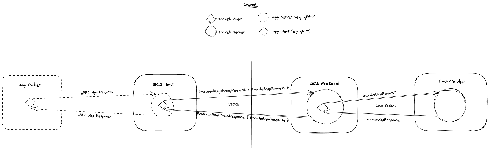

# QuorumOS

QuorumOS is a trusted computation layer for hosting enclave apps at modern cloud scale. The OS architecture is based on the principle that a threshold of actors must coordinate to provision a secure compute environment with sensitive application logic and secret material; no single actor can unilaterally provision the environment or secret material.

Concretely, QuorumOS is designed to boot in an enclave by attesting to the enclave configuration, reconstructing a Quorum Key and then launching a single enclave app that can leverage the Quorum Key to encrypt and authenticate data.

The consensus on environment configuration is coordinated through the Manifest document which describes, among other things, the enclave image configuration, application CLI arguments, public Quorum Key, and quorum sets. During the bootstrapping process, a threshold of Quorum Members will attest to the enclaves configuration against the Manifest out of band and then post their respective Quorum Key share. See the [instance provision](#instance-provision) section for details.

The Quorum Key itself can be used by QuorumOS and enclave apps to encrypt and authenticate data.

## Development

### Submitting a PR

Before a PR can be merged it must:

Be formatted

```bash
make lint
```

And pass all tests

```bash
make test
```

The PR will also need to pass the `build-linux-only-crates` github workflow. There are 3 crates excluded from the rust workspace: `qos_system`, `qos_aws`, and `init`. These crates are excluded because they only build on linux. If you are not working directly with these crates they generally only need to be updated if the dependencies for `qos_core` change. The linux only crates each have their own lockfile and that will need to be up to date for deterministic builds to work. To update the locks files you will need a linux build environment. Once in a linux build enviroment you can run `make build-linux-only`, which will update lock files if neccesary; any updated lock files should then be committed.

### View the docs

In the root of this project run

```bash
cargo doc --open
```

## Conceptual

### Major Components

#### Enclave

- houses server for listening to the Host
- contains logic for quorum key genesis, booting, and running a Enclave App
- see crate `qos_core`

#### Host

- EC2 instance housing the nitro enclave
- has client for talking to nitro enclave
- has server for incoming request from outside world
- see crate `qos_host`

#### Client

- anything making request to host
- see crate `qos_client`

### Key Terms

#### Quorum Key

An asymmetric key used to uniquely authenticate and encrypt data. This key should only ever be reconstituted inside of an enclave. Additionally, the full provisioning of the Quorum Key concludes the attestation flow, at which point QuorumOS pivots to launching the specified enclave app. At rest, outside of the enclave, the key is intended to be stored across shares using shamir's secret sharing. Note that key shares are always intended to be stored encrypted to the Personal Key, never in plaintext.

#### Quorum Member

An entity that is a member of the Manifest Set and holds a share of the Quorum Key.

#### Quorum Sets

There are two types of quorum sets:

##### Manifest Set

The collection of members whom can approve a manifest. In the typical instance provisioning flow, the Manifest Set will approve the details of the Manifest and then the Share Set members can trust a manifest if it has threshold approvals from the Manifest Set. This creates a logical division of responsibilities between Share Keys and Manifest Keys that enables better key usage practices and organizations to scale parts of the provision flow separately.

##### Share Set

The collection of members whom each hold shares of the Quorum Key and thus provision an enclave by attesting and then posting their shares. When posting shares, these members will also provide a signature of the manifest. The signature is recorded in manifest envelope in order to leave an audit trail. This way, third parties can check which share set members actually participated in provisioning the quorum key

#### Manifest Key

A key that is part of the manifest set. This key is used to approve (sign) manifests.

#### Share Key

A key that is part of the Share Set. This is a key that the genesis service encrypts a share too.

#### Ephemeral Key

An asymmetric key that is generated by a QuorumOS instance immediately after boot. Once Quorum Members are able to verify the integrity of a QuorumOS instance, they encrypt their Quorum Key shares to the Ephemeral Key and submit to the instance for reconstruction.

#### Manifest

A file that contains the static configuration to launch an instance of QuorumOS. The composition of the Manifest is attested to in the boot process. All Quorum Members will agree to the Manifest by signing it (QuorumOS should reject a submitted manifest if it has less than threshold signatures.)

#### Node

A single machine compute instance running QuorumOS.

#### Namespace

A group of QuorumOS Nodes running the same Enclave App and using the same Quorum Key. A Namespace contains many live Nodes all with the same Quorum Key and enclave app. Some of these nodes could be using different Manifests and different versions of the same enclave app.

#### Pivot / Enclave App

The application QuorumOS pivots to once it finishes booting. This applications binary hash and CLI arguments are specified in the Manifest file.

### Instance Provision

Immediately after a valid Manifest is loaded into QuorumOS, the instance will generate an Ephemeral Key. This key is specific to a particular individual machine and, after successfully verifying the machine image and metadata contained in the manifest file, will be used by the Quorum Members to post their shares into the machine.
Prior to posting their share to the machine, Quorum Members use a variety of cryptographic attestations and social coordination to determine if it is appropriate to provision a particular instance of QuorumOS with a given secret.
Upon successful verification of the attestation outputs, each member will encrypt their share to an Ephemeral Key. Once threshold shares have been collected by the instance, it will use Shamir’s Secret Sharing to reconstruct the Quorum Key.

#### Remote Attestation

The purpose of remote attestation is to prove that an environment is running a particular piece of software. In the case of AWS Nitro Enclaves, an enclave can uniquely asks the Nitro Security Module (NSM) for an attestation document containing details of the enclave. This document is signed by the Nitro Attestation PKI and is tied back to the AWS Nitro Attestation PKI Root.
As defined in the [AWS documentation](https://docs.aws.amazon.com/enclaves/latest/user/verify-root.html) the instance can request the Nitro Security Module (NSM) to produce an attestation document on its behalf. Additionally, the attestation document contains two fields that can be modified by the enclave itself. The attestation document request contains the Ephemeral Key and the hash of manifest so Share Set members can verify the data is correct.
Before provisioning a namespace with the Quorum Key, a Share Set will use the output of the attestation process against the enclave to verify that the enclave is running the expected version of QuorumOS and that that instance is configured in the expected manner as to warrant being provisioned with that Quorum Key.

Continued reading for attesting with nitro enclaves:

- <https://docs.aws.amazon.com/enclaves/latest/user/set-up-attestation.html>
- <https://docs.aws.amazon.com/enclaves/latest/user/verify-root.html>
- <https://docs.aws.amazon.com/enclaves/latest/user/nitro-enclave.html>

### Enclave Data Flow

Nitro enclaves have a single socket for communicating to its EC2 instance. When QuorumOS initially starts up, it starts listening on a [socket server](./qos_core/src/server.rs) for [`ProtocolMsg`s](./qos_core/src/protocol/msg.rs) (the routing logic for the enclave server is [here](src/qos_core/src/protocol/mod.rs)) that are sent over a single VSOCK connection with the EC2 instance. The enclave server only supports simple request/response communication with a client on the EC2 instance end of the VSOCK connection.

For communicating just with the QuorumOS enclave server, we have [`qos_host`](./qos_host/src/lib.rs), a simple HTTP service that allows for `GET`ing health checks and `POST`ing `ProtocolMsg`s.

We expect that Enclave Apps will have their own host (app host) that will talk to the enclave server over the same socket. A Enclave App is expected to use a simple request/response pattern and arbitrary message serialization. Communication to an app is proxied by the QuorumOS enclave server; so for a app host to communicate with the app it must send a `ProtocolMsg::ProxyRequest { data: Vec<u8> }` to the QuorumOS enclave server, and then the enclave server will send just the `data` to the application over a unix socket. The app will respond to the enclave server with raw data and then the enclave server will respond to the app host with `ProtocolMsg::ProxyResponse { data: Vec<u8> }`.

We expect an EC2 instance to have both a QuorumOS host for booting the enclave and doing health checks and an app host for app specific communication.

Below is a diagram showing the aforementioned app data flow. The diagram mentions gRPC just as an arbitrary example for a protocol that an app caller would use to communicate with the app host.


[Excalidraw link](https://app.excalidraw.com/s/6bemxcXUAIE/251cQGJS1by)
